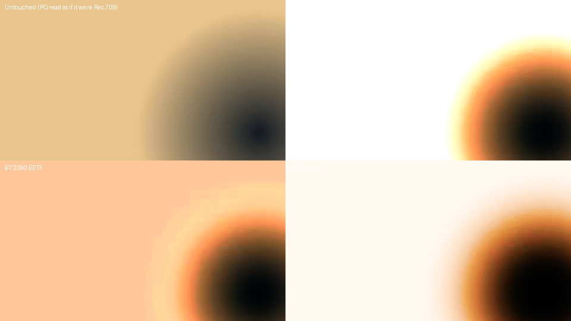

# Video Color Translator

A Linux desktop tool for **interpreting** video colour — reading what a file
actually is, overriding that when the file is wrong, converting HDR and camera
LOG footage to a delivery space, trimming it, and exporting without touching
anything else.

It is not an editor. There is no timeline, no cuts, no keyframes. It does one
job: the thing Premiere calls *Interpret Footage*, plus enough of a Lumetri
panel to finish the shot.



---

## Why it exists

Open S-Log3 footage in most players and it looks grey and lifeless. Open an
HDR10 file and it looks washed out. Neither is a decoding bug — both are
interpretation problems, and most tools either guess silently or make you dig
through a colour-management dialog built for a different job.

This one shows you what the file claims, tells you how much of that it actually
believes, and lets you say otherwise.

---

## How it works

Every transform this tool applies — transfer decode, gamut conversion, tone
mapping, exposure, contrast, white balance, highlights, shadows, saturation —
is a per-pixel function of RGB. So the whole chain collapses into a single 3D
lookup table:

```
                     ColorPipeline  (NumPy, pure functions)
                                 │
                   bakes a 33³ LUT in ~10 ms
                                 │
              ┌──────────────────┴──────────────────┐
              ▼                                     ▼
    GL_TEXTURE_3D in the preview          .cube file handed to FFmpeg
    (one texture lookup per pixel)        lut3d, tetrahedral interpolation
```

Three things follow from that, and they are the reason the tool is built this
way:

**The preview and the export are the same transform.** Not two implementations
kept in sync — one table, two consumers. Measured on decoded HDR frames, the
preview and the rendered file agree to a mean of **0.008 / 255**.

**Dragging a slider is instant regardless of resolution.** A slider change
rebakes 35 937 LUT entries, not two million pixels. 4K footage costs exactly
what 720p costs.

**Nothing depends on an unusual FFmpeg build.** Only `lut3d`, `scale` and
`setparams` are needed, and every distro build has them. No `libplacebo`, no
`zscale`, no OpenCL.

The LUT's input domain is the source's *own* coded values — S-Log3 code values
stay S-Log3 code values — which is how camera LUTs are defined and keeps the
domain bounded in [0, 1] with no shaper required.

---

## What it does

### Reads the file honestly

`ffprobe` supplies codec, bit depth, pixel format, frame rate, range, and the
colour tags. HDR10 mastering-display and MaxCLL metadata is read from the first
frame's SEI, which is where HEVC actually puts it, and auto-fills the source
peak.

Then it distinguishes two very different situations, because conflating them is
what produces confidently wrong conversions:

| Situation | What the tool says |
|---|---|
| PQ / HLG, genuinely tagged | **From file metadata** — trusted and applied |
| Camera LOG | **Guess — check this**, shown in warning colour, with the reason |
| No usable tags | **Not detected — defaulted** to Rec.709 |

A camera recording S-Log3 writes `bt709` into the file. Nothing in the metadata
can distinguish it from ordinary Rec.709 footage — only the picture can, and
only you can judge that. So LOG is never presented as detected. The manual
override is the primary path, not a fallback.

### Interprets

**Camera LOG** — Sony S-Log3, Panasonic V-Log, Canon C-Log2 and C-Log3, Nikon
N-Log, ARRI LogC3, Apple Log, Blackmagic Film Gen 5. Each curve is implemented
from its vendor's published formula and tested against its published 18% grey
anchor to within one 10-bit code value.

Each entry sets the gamut too — S-Log3 footage is S-Gamut3.cine footage, and
interpreting one without the other leaves the image a different kind of wrong.

**HDR** — PQ (ST 2084) and HLG (ARIB STD-B67), with the HLG OOTF applied for
the nominal display peak.

**Standard** — Rec.709, sRGB, gamma 2.2/2.4/2.6, Rec.601, Display P3, DCI-P3,
linear.

Transfer and gamut can also be overridden separately for footage that fits no
preset, along with the YUV matrix and the source range.

### Tone maps

Everything is normalised so **1.0 is diffuse white at 203 cd/m²**, per ITU-R
BT.2408 — not the source peak. That single choice is what keeps mid-tones where
they belong. Normalising by peak instead drags a face down by three stops and
produces the muddy look people associate with HDR-to-SDR conversion.

Measured response of a 1000-nit PQ source to Rec.709:

| Source | BT.2390 | ACES | Hable | Reinhard | Clip |
|---:|---:|---:|---:|---:|---:|
| 20 nits | 28.8% | 16.3% | 18.1% | 27.3% | 28.8% |
| 100 nits | 69.8% | 60.3% | 45.5% | 57.4% | 70.0% |
| **203 nits** (diffuse white) | **88.6%** | 78.7% | 62.1% | 72.0% | **100.0%** |
| 400 nits | 97.7% | 89.5% | 79.2% | 84.7% | 100.0% |
| 1000 nits (peak) | 100.0% | 96.4% | 100.0% | 100.0% | 100.0% |

Read the first and last columns together. Clipping puts diffuse white *and*
every highlight above it at 100% — the sky, the window and the practical lamp
all become the same flat white. BT.2390 passes everything below its knee
through untouched (compare its numbers to Clip's in the mid-tones — identical)
and spends the top 11% of the range separating what used to be 203 through 1000
nits. ACES rolls off more gently still and is the only operator here that keeps
4000-nit specular highlights distinguishable.

Two shared controls: **luminance vs per-channel** application (per-channel
desaturates highlights the way film does; luminance preserves hue exactly), and
**highlight desaturation**, which rolls saturated highlights toward white so a
bright red light reads as a glow rather than a flat red patch.

Out-of-gamut colour is folded back in with **ACES-style gamut compression**
rather than clipped — automatically, when the source gamut is wider than the
target. Clipping a wide-gamut conversion flattens saturated colour into
hard-edged patches of pure primary. Compression costs a little saturation and
keeps the hue and the gradient. It also happens to cut peak LUT interpolation
error by 4×.

### Adjusts

Exposure, contrast, saturation, temperature, tint, highlights, shadows, black
point, white point.

Each runs in the domain where it behaves the way you expect, and the order is
documented in the panel:

1. **Exposure** — linear gain in stops, before tone mapping, so pushing into
   the highlights rolls off instead of clipping.
2. **Temperature / tint** — a real chromatic adaptation (CAT02) between white
   points on the CIE daylight locus, not a per-channel gain, so neutrals stay
   neutral and skin does not swing magenta. Tint moves perpendicular to the
   locus, so it does not drag temperature along with it.
3. **Contrast** — slope around 18% grey in log space; mid grey does not move.
4. **Highlights / shadows** — luminance-masked *gain*, not lift, so pushing
   shadows up brightens what is there without lifting black into a milky haze.
5. **Saturation**, then **black/white point** — on the encoded output signal.

### Exports

`lut3d` with tetrahedral interpolation, at encoder speed.

- **Codecs** — H.264 (libx264), H.265 (libx265, 10-bit by default), ProRes
  (prores_ks, Proxy through 4444 XQ).
- **Quality** — CRF slider with the resulting CRF shown, plus preset; or an
  explicit bitrate.
- **Containers** — `.mp4`, `.mov`, `.mkv`, filtered to what the codec supports.

Every field defaults to **match source**, so the shortest path through the
dialog changes nothing but the colour:

- No `-r` unless you override it. Timestamps pass through, so 23.976 and
  variable-rate footage come out unchanged — verified by test.
- Audio copied without re-encoding.
- Source resolution.
- Output correctly tagged, so players do not convert it a second time.

The dialog will show you the exact FFmpeg command it is about to run.

**Save .cube LUT** writes the current transform as a 3D LUT for Resolve,
Premiere, or anything else that loads `.cube`.

### Preview

Scrub, play/pause, frame step, timecode. Video only — no audio.

**Bypass (B)** shows the source untouched. It is the most useful control in the
window: a grade is judged against what it started from. Bypass is a viewing
aid, and is excluded from saved LUTs and exports.

---

## Install

### Ubuntu / Debian

```bash
sudo apt install python3 python3-pip python3-venv ffmpeg \
                 libgl1 libegl1 libxkbcommon-x11-0 libxcb-cursor0

git clone https://github.com/JordyUSA/Video-Color-Translator.git
cd Video-Color-Translator
python3 -m venv .venv && source .venv/bin/activate
pip install -e .
vct
```

### Arch

```bash
sudo pacman -S python python-pip ffmpeg qt6-base libxkbcommon-x11

git clone https://github.com/JordyUSA/Video-Color-Translator.git
cd Video-Color-Translator
python -m venv .venv && source .venv/bin/activate
pip install -e .
vct
```

### Fedora

```bash
sudo dnf install python3 python3-pip ffmpeg mesa-libGL libxkbcommon-x11
# ffmpeg comes from RPM Fusion
```

No FFmpeg available? `pip install -e '.[bundled-ffmpeg]'` pulls a static build
in through the `imageio-ffmpeg` wheel. Note that wheel ships `ffmpeg` but not
`ffprobe`, so a system FFmpeg is still the better option.

### Requirements

- Python 3.9+, FFmpeg 6.x or 7.x (needs `lut3d`, `setparams`, `scale`)
- PySide6 ≥ 6.5, NumPy ≥ 1.22
- OpenGL 3.3 for the GPU preview — optional, there is a CPU fallback

### Usage

```bash
vct                              # empty, open from the File menu or drag a file in
vct footage.mov                  # open a file directly
vct --cpu                        # force the CPU preview
vct --lut-size 65                # higher LUT precision
```

`VCT_FFMPEG` and `VCT_FFPROBE` override binary discovery.

A desktop launcher is in [`packaging/`](packaging/).

---

## Development

```bash
pip install -e '.[dev]'
pytest                                    # 306 tests
QT_QPA_PLATFORM=offscreen pytest tests/test_ui.py
```

Tests requiring FFmpeg skip cleanly without it. The UI tests run headless.

```
vct/
├── core/       colour maths — pure NumPy, no Qt, no FFmpeg
│   ├── transfer.py         OETF/EOTF pairs incl. 8 camera LOG curves
│   ├── colorimetry.py      gamuts from CIE primaries, chromatic adaptation
│   ├── tonemap.py          operators, HDR normalisation, gamut compression
│   ├── grade.py            the adjustment operations
│   ├── pipeline.py         the chain, in one place
│   └── lut.py              LUT baking, .cube I/O, CPU sampling
├── media/      FFmpeg — discovery, probe, detection, decode, export
└── ui/         PySide6 — preview, panels, playback, export dialog
```

`core/` imports neither Qt nor FFmpeg. That is what makes the colour maths
testable in CI, and it is where the interesting parts live.

### What the tests actually check

Not just that functions run:

- Every transfer function round-trips, and every LOG curve hits its **vendor's
  published 18% grey** within one 10-bit code value.
- A neutral Rec.709 → Rec.709 conversion bakes an **exact identity LUT** — the
  single best guard against an accidental double conversion.
- Tone mapping operators are monotonic, pass through black, map source peak to
  display white, and do not crush mid-tones.
- The temperature slider's zero is exactly D65, and the curve is continuous
  where the Planckian and daylight loci meet.
- Reading S-Log3 in the wrong range moves the shadows by more than a stop, so
  the range control is not theatre.
- **The preview LUT and an actual FFmpeg render agree**, compared on real
  decoded HDR frames.
- A 23.976 fps source exports as 23.976 fps with every frame intact.

---

## Limitations

**ProRes RAW is not supported.** FFmpeg has no decoder for it — Apple has not
published the format, and no open implementation exists. Files will fail to
open with a decode error. Apple Log in ProRes *is* fully supported, and is what
most Apple Log footage actually is. Transcode ProRes RAW to ProRes 4444 first.

**The OpenGL preview has not been run on real hardware.** It was written and
reviewed but the build container has no GPU or display, so only the CPU path is
covered by tests. If GL initialisation or the first draw fails, the application
catches it and falls back to the CPU preview rather than crashing — but the GPU
path is the least-proven code here. `--cpu` skips it entirely.

**S-Log2 and S-Log1 are not included.** Sony's published figures for those did
not reconcile against the formulas available, and a LOG curve that is subtly
wrong is worse than one that is absent. S-Log3 is what current Sony bodies use.

**LUT precision.** At the default 33³, interpolation error is a mean of
0.3/255 with a worst case around 13/255 on extreme out-of-gamut colours that
real footage rarely contains. `--lut-size 65` drops that to 0.08/255 mean and
5/255 worst case.

**Not included by design:** scopes (waveform, vectorscope, histogram),
keyframes or animated grades, batch export, secondary/qualifier correction,
audio processing.

---

## Licence

MIT.
